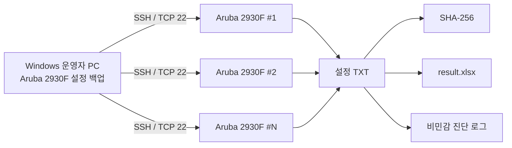

# Aruba 2930F 설정 백업

**ArubaOS-Switch 기반 Aruba 2930F 여러 대의 `running-config`를 SSH로 일괄 수집하는 Windows용 읽기 전용 도구입니다.**

반복적인 장비 접속과 수동 설정 백업을 줄이고, 장비 식별·SSH 장비 지문 검증·수집 결과 무결성 확인까지 하나의 운영 절차로 묶는 것을 목표로 합니다.

> 현재 배포 버전은 **v0.1.8 사전릴리즈**입니다. 자동 검증과 Windows 패키지 검증은 통과하지만 실제 운영 장비 검증은 별도로 수행해야 합니다. 자세한 범위는 [검증 현황](#검증-현황)을 참고하십시오.

## 운영 관점 요약

| 항목 | 내용 |
|---|---|
| 대상 장비 | Aruba 2930F / 2930F VSF |
| 네트워크 OS | ArubaOS-Switch |
| 접속 방식 | SSH, 기본 TCP 22 |
| 수집 명령 | `show running-config` |
| 장비 변경 | **없음 — 설정 모드에 진입하지 않음** |
| 사전 확인 | SSH 장비 지문, EXEC 프롬프트, `no page`, 모델/SKU |
| 동시 처리 | 기본 10대, 최대 20대 |
| 결과 | 장비별 TXT, SHA-256, `result.xlsx`, 진단 로그 |
| 실행 환경 | Windows x64, Python 설치 불필요한 배포 ZIP |
| 현재 상태 | 사전릴리즈 / 실제 장비 현장 검증 필요 |

## 왜 만들었나

여러 대의 액세스 스위치 설정을 수동으로 백업하면 다음 문제가 반복됩니다.

- 장비마다 접속하고 `show running-config`를 실행해야 함
- 페이지 출력 때문에 설정 일부가 누락될 수 있음
- 잘못된 장비에 접속했는지 사람이 직접 판단해야 함
- 일부 장비의 일시적인 SSH 실패 때문에 전체 작업이 끊길 수 있음
- 백업 파일과 실행 결과를 별도로 정리해야 함
- 백업 파일이 정상적으로 저장되었는지 무결성 확인이 필요함

이 도구는 위 작업을 **장비 확인 → 읽기 전용 수집 → 결과 검증 → 보고서 생성** 흐름으로 자동화합니다.

## 핵심 기능

- 여러 IPv4 주소를 붙여 넣어 Aruba 2930F를 병렬 백업
- 매 연결에서 `no page`를 먼저 적용하고 응답을 검증
- `show version`, `show modules`를 이용한 2930F / VSF 식별
- 모델 확인 후에만 `show running-config` 실행
- 최초 SSH 장비 지문 검토 및 이후 지문 변경 차단
- 일시적인 연결 오류에 대해 5초 → 15초 → 30초 지연 재시도
- 재시도 소진 장비만 별도로 다시 수집
- 장비별 TXT 설정 백업과 SHA-256 계산
- 실행 결과를 `result.xlsx`로 정리
- 암호와 Enable 암호를 파일에 저장하지 않음
- Python이 없는 Windows PC에서도 실행 가능한 x64 배포 ZIP 제공

## 동작 구조



장비 한 대에 대한 수집 순서는 다음과 같습니다.

```text
SSH 장비 지문 확인
        ↓
EXEC 프롬프트 확인
        ↓
no page 적용 및 검증
        ↓
show version
show modules
        ↓
Aruba 2930F / VSF 식별
        ↓
show running-config
        ↓
최종 프롬프트·출력 검증
        ↓
TXT 저장 + SHA-256 + Excel 결과 기록
```

설정 모드에 진입하거나 장비 구성을 변경하는 명령은 실행하지 않습니다.

## 지원 및 검증 범위

### 지원 범위

| 구분 | 상태 | 비고 |
|---|---|---|
| Aruba 2930F | 지원 | 모델/SKU 확인 후 설정 수집 |
| Aruba 2930F VSF | 지원 | 복수 공식 SKU가 확인되는 구성 포함 |
| ArubaOS-Switch | 지원 대상 | 장비별 OS 차이는 현장 검증 필요 |
| SSH 암호 인증 | 지원 | 공통 계정 사용 |
| Enable 암호 | 선택 지원 | 필요한 환경에서만 사용 |
| IPv4 | 지원 | 현재 입력 대상 |
| Windows x64 | 지원 | 배포 ZIP 기준 |
| 다른 Aruba 모델 | 미지원 | 2930F 외 장비는 차단 |
| 설정 복원/변경 | 미지원 | 의도적으로 읽기 전용 |

### 검증 현황

| 검증 항목 | 상태 |
|---|---|
| 단위 테스트 | ✅ 자동 검증 |
| 가상/루프백 SSH 장비 | ✅ 자동 검증 |
| 레거시 SSH 알고리즘 경로 | ✅ 자동 검증 |
| Windows 패키지 실행 점검 | ✅ 자동 검증 |
| 릴리즈 ZIP SHA-256 검증 | ✅ 자동 검증 |
| SBOM 생성 및 검증 | ✅ 자동 검증 |
| 실제 Aruba 2930F 운영 장비 | ⚠️ 별도 현장 검증 필요 |
| 대규모 운영망 장시간 검증 | ⚠️ 별도 현장 검증 필요 |

자동 테스트 통과가 실제 운영 장비에서의 완전한 호환성을 보증하지는 않습니다. 처음 적용할 때는 소수 장비에서 결과를 대조한 뒤 범위를 확대하는 방식을 권장합니다.

## 빠른 시작

1. GitHub **Releases**에서 `Aruba2930FConfigBackup_v0.1.8_windows_x64.zip`과 같은 Windows x64 ZIP을 받습니다.
2. 함께 제공되는 `.sha256` 파일로 ZIP 해시를 확인합니다.

```powershell
Get-FileHash .\Aruba2930FConfigBackup_v0.1.8_windows_x64.zip -Algorithm SHA256
Get-Content .\Aruba2930FConfigBackup_v0.1.8_windows_x64.zip.sha256
```

3. ZIP 전체를 쓰기 가능한 로컬 폴더에 압축 해제합니다.
4. `Aruba2930FConfigBackup\Aruba2930FConfigBackup.exe`를 실행합니다.
5. 장비 IP, SSH 계정, 동시 접속 수를 입력한 뒤 **백업 시작**을 누릅니다.
6. 처음 보는 장비의 SSH 장비 지문은 실제 관리 정보와 대조한 뒤 승인합니다.
7. 완료 후 장비별 TXT와 `result.xlsx`를 확인합니다.

> EXE만 ZIP에서 따로 꺼내 실행하지 마십시오. 현재 사전릴리즈는 Authenticode 서명이 없어 Windows SmartScreen 경고가 표시될 수 있습니다.

## 장비에서 실행되는 명령

수집 과정에서 사용하는 핵심 명령은 다음과 같습니다.

```text
no page
show version
show modules
show running-config
```

- `no page`가 정상 적용되지 않으면 이후 `show` 명령을 실행하지 않습니다.
- `show version`과 `show modules`로 2930F 계열 여부를 확인합니다.
- 2930F 식별이 끝난 뒤 `show running-config`를 한 번 실행합니다.
- `(config)#`와 같은 설정 모드 프롬프트는 허용하지 않습니다.

프롬프트 처리, 출력 한도, 레거시 SSH 알고리즘 등 상세 동작은 [SSH 수집 및 운영 안전](docs/SSH_AND_SAFETY.md)을 참고하십시오.

## 결과 파일

기본 저장 경로:

```text
%USERPROFILE%\Documents\Aruba2930FConfigBackup\backup\YYYY-MM-DD\HHmmss\
├── <hostname>.txt
├── <ip>.txt
├── <hostname>(<ip>).txt
├── operation.jsonl
└── result.xlsx
```

파일 이름은 실행 시 **장비 이름 / IP / 장비 이름(IP)** 중 하나를 선택할 수 있습니다. 장비 이름을 확인할 수 없으면 IP를 사용합니다.

`result.xlsx`에는 다음과 같은 운영 결과가 기록됩니다.

- 장비 주소
- 확인된 호스트명과 모델/SKU
- 성공/실패 상태
- SSH 장비 지문 및 백업 시도 횟수
- 전체 연결 시도 횟수
- 소요 시간
- 백업 파일 경로
- SHA-256
- 오류 분류
- 오프라인 진단 코드

백업 TXT에는 실제 장비 설정이 포함되므로 조직의 설정 파일 보관 정책에 따라 보호해야 합니다.

## 운영 안전 원칙

이 프로젝트는 다음 원칙을 고정합니다.

- 장비 설정을 변경하지 않음
- 설정 모드에 진입하지 않음
- 모델 확인 전에 `show running-config`를 실행하지 않음
- 새 SSH 장비 지문은 운영자가 검토
- 승인된 장비 지문이 변경되면 연결 차단
- 암호와 Enable 암호를 파일에 저장하지 않음
- 미완성 백업 파일을 정상 결과로 처리하지 않음
- 릴리즈 ZIP의 SHA-256과 빌드 출처를 검증

세부 정책은 [SSH 수집 및 운영 안전](docs/SSH_AND_SAFETY.md)과 [SECURITY.md](SECURITY.md)를 참고하십시오.

## 재시도 정책

일시적인 네트워크 오류와 명령 시간초과처럼 재시도 가능한 실패에만 적용합니다.

| 시도 | 실행 시점 |
|---|---|
| 1차 | 즉시 |
| 2차 | 첫 실패 후 5초 |
| 3차 | 두 번째 실패 후 15초 |
| 4차 | 세 번째 실패 후 30초 |

인증 실패, SSH 장비 지문 변경, 미지원 모델처럼 동일 조건에서 반복해도 의미가 없는 오류는 즉시 종료합니다.

## 현재 범위 밖

- 예약 실행 및 Windows 서비스/에이전트 모드
- Excel/CSV 장비 목록 가져오기
- 장비별 서로 다른 계정
- SSH 개인 키 인증
- IPv6 및 DNS 호스트명 입력
- 설정 비교 및 변경 탐지
- 설정 복원
- 장비 설정 변경
- Aruba 2930F 이외 모델

## 상세 문서

| 문서 | 내용 |
|---|---|
| [ARCHITECTURE.md](docs/ARCHITECTURE.md) | 프로그램 구성, 수집 단계, 결과 생성 흐름 |
| [SSH_AND_SAFETY.md](docs/SSH_AND_SAFETY.md) | 프롬프트, `no page`, 모델 식별, 레거시 SSH, 안전 경계 |
| [ERROR_CODES.md](docs/ERROR_CODES.md) | 오류 코드와 1차 확인 방향 |
| [TROUBLESHOOTING.md](docs/TROUBLESHOOTING.md) | 현장 적용 시 점검 순서와 대표 문제 |
| [RELEASE_POLICY.md](docs/RELEASE_POLICY.md) | 버전·릴리즈·검증 원칙 |
| [SECURITY.md](SECURITY.md) | 취약점 제보와 보안 정책 |
| [CHANGELOG.md](CHANGELOG.md) | 버전별 상세 변경 이력 |

## 개발 및 검증

소스 실행에는 Windows x64와 CPython 3.14가 필요합니다.

```powershell
py -3.14 -m venv .venv
.\.venv\Scripts\python.exe -m pip install --upgrade pip
.\.venv\Scripts\python.exe -m pip install `
  -r .\requirements-lock.txt -r .\requirements-dev.txt
.\.venv\Scripts\python.exe -m pip install --no-deps -e .
.\.venv\Scripts\python.exe -m aruba2930f_backup
```

저장소 전체 검증:

```powershell
powershell -ExecutionPolicy Bypass -File .\tools\validate.ps1 `
  -PythonPath .\.venv\Scripts\python.exe
```

Windows 배포 패키지 빌드:

```powershell
powershell -ExecutionPolicy Bypass -File .\build_windows.ps1 `
  -PythonPath C:\Python314\python.exe -Version 0.1.8
```

## 릴리즈 원칙

작은 문구 수정이나 내부 정리는 즉시 새 버전을 만들지 않고 `Unreleased`에 모읍니다. 실제 운영 영향이 있는 기능 묶음이나 버그 수정이 준비되고 자동 검증이 통과했을 때 릴리즈합니다.

릴리즈에는 Windows x64 ZIP, SHA-256, CycloneDX SBOM이 포함되며, 태그·`main` 커밋·빌드 산출물 출처가 일치할 때만 게시됩니다. 자세한 기준은 [RELEASE_POLICY.md](docs/RELEASE_POLICY.md)를 참고하십시오.

## 라이선스와 보안 제보

MIT License로 배포됩니다.

보안 문제를 제보할 때는 공개 Issue에 장비 IP, 설정 원문, 계정 또는 자격증명을 올리지 마십시오. 자세한 절차는 [SECURITY.md](SECURITY.md)를 참고하십시오.
