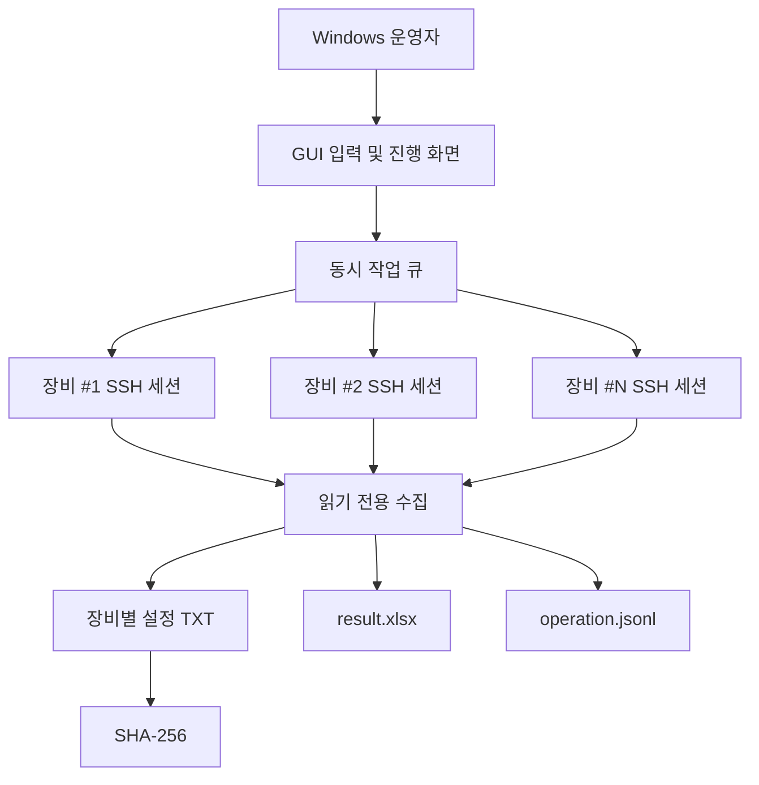

# 프로그램 구조

## 목적

이 문서는 Aruba 2930F 설정 백업 도구가 장비 한 대를 어떤 순서로 확인하고, 어떤 조건에서 설정을 수집하며, 결과를 어떻게 저장하는지 설명합니다.

핵심 설계 목표는 다음과 같습니다.

1. 장비 설정을 변경하지 않는다.
2. 잘못된 장비나 불완전한 CLI 응답을 정상 백업으로 처리하지 않는다.
3. 일부 장비 실패가 전체 수집 작업을 중단시키지 않도록 한다.
4. 실행 결과를 장비별 파일과 실행 단위 보고서로 함께 남긴다.
5. 운영자가 릴리즈 산출물의 출처와 무결성을 확인할 수 있게 한다.

## 전체 구성



## 장비별 처리 단계

### 1. 입력 검증

수집을 시작하기 전에 다음 값을 확인합니다.

- IPv4 주소 형식
- 중복 주소
- SSH 포트
- 동시 작업 수
- 결과 폴더
- 공통 SSH 계정
- 선택적 Enable 암호

잘못된 주소나 중복 주소가 있으면 일부만 임의로 실행하지 않고 입력 단계에서 중단합니다.

### 2. SSH 장비 지문 확인

처음 접속하는 장비는 인증 전에 서버 공개 키의 SHA-256 지문을 표시합니다.

운영자가 승인한 지문은 사용자별 `known_hosts.json`에 저장합니다. 이후 같은 IP에서 다른 지문이 제시되면 자동으로 신뢰하지 않고 연결을 차단합니다.

### 3. EXEC 상태 확인

로그인 배너와 필요한 초기 입력을 처리한 뒤 EXEC 프롬프트를 확인합니다.

설정 모드처럼 보이는 프롬프트는 허용하지 않습니다. 이후 명령 응답도 처음 확인한 EXEC 프롬프트로 정상 종료되었는지 검증합니다.

### 4. 페이지 출력 비활성화

모든 연결과 재연결에서 `show` 명령보다 먼저 `no page`를 적용합니다.

`no page`가 거부되거나 명령 완료를 확인할 수 없으면 해당 장비의 수집을 중단합니다.

### 5. 장비 식별

다음 정보를 함께 사용합니다.

```text
show version
show modules
```

공식 2930F SKU 또는 신뢰할 수 있는 2930F 계열 증거가 확인된 경우에만 다음 단계로 이동합니다.

다른 장비 계열, 미지원 섀시 SKU 또는 상충하는 증거가 있으면 설정을 읽지 않습니다.

### 6. 설정 수집

장비 식별 후 다음 명령을 한 번 실행합니다.

```text
show running-config
```

수집 완료 조건:

- 예상한 EXEC 프롬프트로 정상 복귀
- 잔여 페이지 표시가 없음
- 출력 제한을 초과하지 않음
- 취소되지 않음
- 명령 거부가 없음

### 7. 결과 저장

정상 완료된 설정만 TXT로 저장합니다.

저장 후 SHA-256을 계산하고 `result.xlsx`에 장비별 결과를 기록합니다. 미완성 임시 파일은 정상 결과로 취급하지 않습니다.

## 동시 처리와 재시도

여러 장비를 한꺼번에 열지 않고 설정된 동시 작업 수만큼 처리합니다.

일시적인 실패는 다음과 같이 지연 재시도합니다.

```text
1차: 즉시
2차: 5초 후
3차: 15초 후
4차: 30초 후
```

재시도 대기 중인 장비가 작업 스레드를 계속 점유하지 않도록 설계되어 다른 정상 장비의 수집은 계속 진행됩니다.

인증 실패, 장비 지문 변경, 모델 불일치 등 반복해도 결과가 달라질 가능성이 낮은 오류는 지연 재시도하지 않습니다.

## 결과 구조

```text
backup\YYYY-MM-DD\HHmmss\
├── <hostname>.txt
├── <ip>.txt
├── <hostname>(<ip>).txt
├── operation.jsonl
└── result.xlsx
```

### 설정 TXT

실제 `running-config` 결과입니다. 조직의 네트워크 구성 정보가 포함될 수 있으므로 민감정보로 취급해야 합니다.

### result.xlsx

한 번의 실행 결과를 요약합니다.

주요 정보:

- 장비 주소
- 호스트명
- 모델/SKU
- 결과 상태
- 장비 지문/백업 시도 횟수
- 전체 연결 시도 횟수
- 소요시간
- 백업 파일
- SHA-256
- 오류 분류
- 진단 코드

### operation.jsonl

운영 단계와 오류 분류를 진단하기 위한 로그입니다. 암호와 장비 설정 원문을 남기지 않는 것을 기본 원칙으로 합니다.

## 릴리즈 검증 구조

정식 릴리즈 자동화는 다음을 확인합니다.

```text
annotated tag
      ↓
현재 main 커밋과 일치
      ↓
잠긴 의존성 설치
      ↓
테스트 / 정적 검증 / 의존성 감사
      ↓
Windows x64 패키지 빌드
      ↓
ZIP 구조 및 실행 점검
      ↓
SHA-256 / SBOM / BUILD_INFO 검증
      ↓
GitHub 사전릴리즈 게시
```

빌드와 게시 사이에 태그나 `main`이 움직이면 게시를 중단하도록 구성되어 있습니다.

## 설계상 의도적으로 하지 않는 것

이 프로젝트는 설정 백업에 범위를 제한합니다.

- 설정 모드 진입
- VLAN/ACL/라우팅 등 구성 변경
- 설정 복원
- 자동 장애 조치
- 장비 펌웨어 변경
- 2930F가 아닌 장비를 추정하여 수집

기능을 늘리는 것보다 읽기 전용 경계를 명확히 유지하는 것을 우선합니다.
